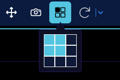

# Module: Toolbar

An extension can register a Toolbar Module by defining a `getToolbarModule`
method. `OHIF-v3`'s `default` extension (`"ohif.org.default"`) provides 5 main toolbar button types:

- [Module: Toolbar](#module-toolbar)
  - [Example Toolbar Module](#example-toolbar-module)
  - [Toolbar buttons consumed in modes](#toolbar-buttons-consumed-in-modes)
  - [Button Definitions](#button-definitions)
  - [Nested Buttons](#nested-buttons)
  - [Layout Template](#layout-template)
  - [Custom Button](#custom-button)
  - [Custom tool](#custom-tool)


## Example Toolbar Module
The Toolbar Module should return an array of `objects`. There are currently a few different variations of definitions,
each one is detailed further down.

```js
export default function getToolbarModule({ commandsManager, servicesManager }) {

  return [
    {
      name: 'ohif.divider',
      defaultComponent: ToolbarDivider,
      clickHandler: () => {},
    },
    {
      name: 'ohif.action',
      defaultComponent: ToolbarButton,
      clickHandler: () => {},
    },
    {
      name: 'ohif.radioGroup',
      defaultComponent: ToolbarButton,
      clickHandler: () => {},
    },
    {
      name: 'ohif.splitButton',
      defaultComponent: ToolbarSplitButton,
      clickHandler: () => {},
    },
    {
      name: 'ohif.layoutSelector',
      defaultComponent: ToolbarLayoutSelector,
      clickHandler: (evt, clickedBtn, btnSectionName) => {},
    }
  ]
}
```


## Toolbar buttons consumed in modes
Below we can see a simplified version of the `longitudinal` mode that shows how
a mode can add buttons to the toolbar by calling `ToolBarService.addButtons(toolbarButtons)`.
`toolbarButtons` is an array of `toolDefinitions` which we will learn next.


```js
export default function mode({ modeConfiguration }) {
  return {
    id: 'viewer',
    displayName: 'Basic Viewer',

    onModeEnter: ({ servicesManager, extensionManager }) => {
      const { ToolBarService } = servicesManager.services;

      ToolBarService.init(extensionManager);
      ToolBarService.addButtons(toolbarButtons);
    },
    routes: [
      {
        path: 'longitudinal',
        layoutTemplate: ({ location, servicesManager }) => {
          return {/* */};
        },
      },
    ],
    extensions: [
      'org.ohif.default',
      'org.ohif.cornerstone',
      'org.ohif.measurement-tracking',
      'org.ohif.dicom-sr',
    ],
  };
}

```


## Button Definitions

The simplest toolbarButtons definition has the following properties:


```js
{
  id: 'Zoom',
  type: 'ohif.radioGroup',
  props: {
    type: 'tool',
    icon: 'tool-zoom',
    label: 'Zoom',
    commandOptions: { toolName: 'Zoom' },
  },
},
```


| property         | description                                                       | values                                    |
| ---------------- | ----------------------------------------------------------------- | ----------------------------------------- |
| `id`             | Unique string identifier for the definition                       | \*                                        |
| `label`          | User/display friendly to show in UI                               | \*                                        |
| `icon`           | A string name for an icon supported by the consuming application. | \*                                        |
| `type`           | Used to determine the button's behaviour                          | "tool", "toggle", "action"                |
| `commandName`    | (optional) The command to run when the button is used.            | Any command registered by a `CommandModule` |
| `commandOptions` | (optional) Options to pass the target `commandName`               | \*                                        |


There are three main types of toolbar buttons:

- `tool`: buttons that enable a tool by running the `setToolActive` command with the `commandOptions`
- `toggle`: buttons that acts as a toggle: e.g., linking viewports
- `action`: buttons that executes an action: e.g., capture button to save screenshot


## Nested Buttons
You can use the `ohif.splitButton` type to build a button with extra tools in the dropdown.

- First you need to give your `primary` tool definition to the split button
- the `secondary` properties can be a simple arrow down (`chevron-down` icon)
- For adding the extra tools add them to the `items` list.

You can see below how `longitudinal` mode is using the available toolbarModule to create
`MeasurementTools` nested button


```js
// modes/longitudinal/src/toolbarButtons.js

{
  id: 'MeasurementTools',
  type: 'ohif.splitButton',
  props: {
    groupId: 'MeasurementTools',
    isRadio: true,
    primary: {
      id: 'Length',
      icon: 'tool-length',
      label: 'Length',
      type: 'tool',
      commandOptions: {
        toolName: 'Length',
      }
    },
    secondary: {
      icon: 'chevron-down',
      label: '',
      isActive: true,
      tooltip: 'More Measure Tools',
    },
    items: [
      // Length tool
      {
        id: 'Length',
        icon: 'tool-length',
        label: 'Length',
        type: 'tool',
        commandOptions: {
          toolName: 'Length',
        }
      },
      // Bidirectional tool
      {
        id: 'Bidirectional',
        icon: 'tool-bidirectional',
        label: 'Length',
        type: 'tool',
        commandOptions: {
          toolName: 'Bidirectional',
        }
      },
      // Ellipse tool
      {
        id: 'EllipticalRoi',
        icon: 'tool-elipse',
        label: 'Ellipse',
        type: 'tool',
        commandOptions: {
          toolName: 'EllipticalRoi',
        }
      },
    ],
  },
}
```

<div style="padding:62.5% 0 0 0;position:relative;"><iframe src="https://player.vimeo.com/video/547957214?badge=0&amp;autopause=0&amp;player_id=0&amp;app_id=58479" frameborder="0" allow="autoplay; fullscreen; picture-in-picture" allowfullscreen style="position:absolute;top:0;left:0;width:100%;height:100%;" title="Toolbar"></iframe></div><script src="https://player.vimeo.com/api/player.js"></script>

## Layout Template
Layout selector button and logic is also provided by the OHIF-v3 `default` extension.
To use it, you can just add the following definition to the list of `toolDefinitions`


```js
{
  id: 'Layout',
  type: 'ohif.layoutSelector',
}
```

<div style="padding:56.25% 0 0 0;position:relative;"><iframe src="https://player.vimeo.com/video/545993263?badge=0&amp;autopause=0&amp;player_id=0&amp;app_id=58479" frameborder="0" allow="autoplay; fullscreen; picture-in-picture" allowfullscreen style="position:absolute;top:0;left:0;width:100%;height:100%;" title="Viewer-layout"></iframe></div><script src="https://player.vimeo.com/api/player.js"></script>


## Custom Button
You can also create your own extension, and add your new custom tool appearance (e.g., split horizantlly instead of vertically for split tool).
Simply add `getToolbarModule` to your extension, and pass your tool react component to its
`defaultComponent` property in the returned object.
You can use `@ohif/ui` components such as `IconButton, Icon, Tooltip, ToolbarButton` to
build your own component.


```js
import myToolComponent from './myToolComponent'


export default function getToolbarModule({ commandsManager, servicesManager }) {

  return [
    {
      name: 'new-tool-type',
      defaultComponent: myToolComponent,
      clickHandler: () => {},
    },
  ]
}
```


## Custom tool
**I want to create a new tool**
